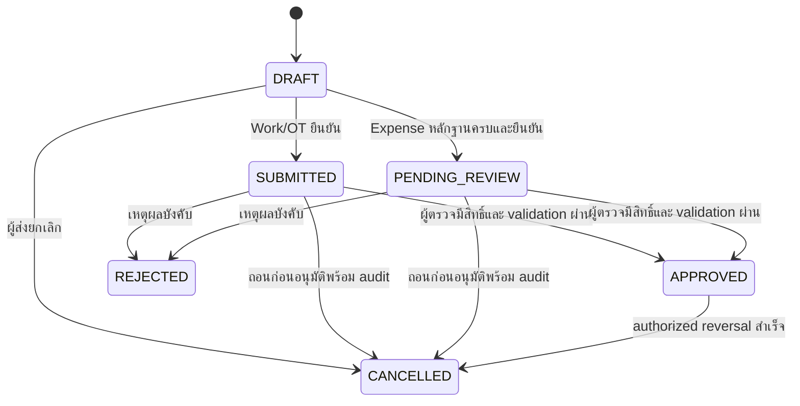
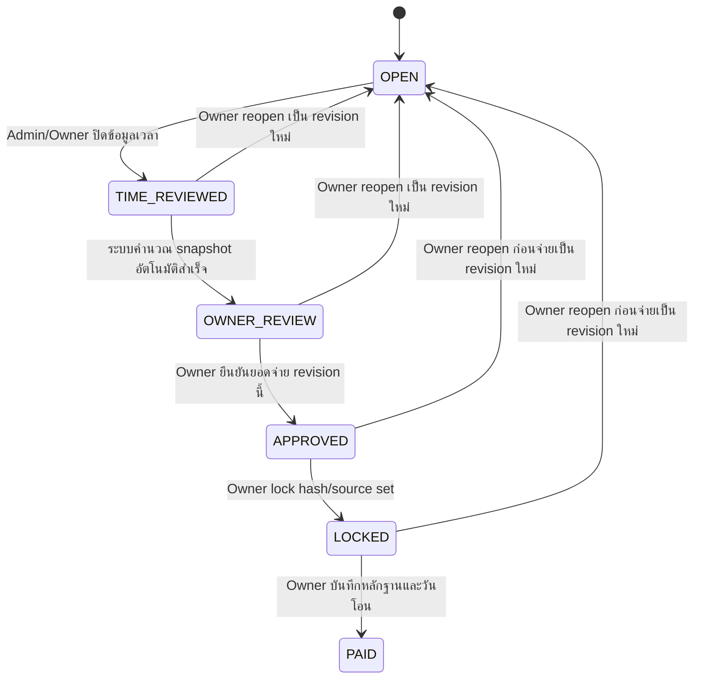
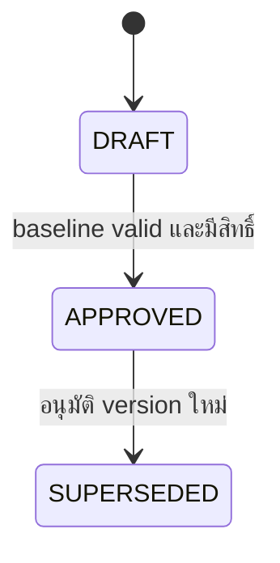
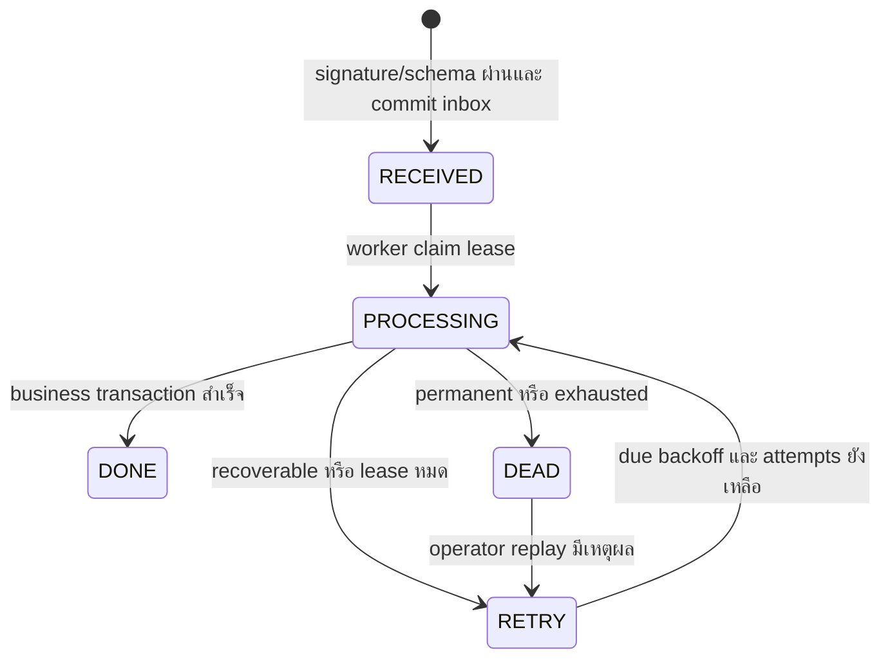

# State diagrams และ transition contract

Expense reviewer=ADMIN/OWNER รายรายการ ตาม [ADR-008](adr/008-admin-review-ot-retention.md); Admin ไม่เห็น Project total/Payroll; PM เห็นเงิน/รูปเฉพาะexpenseของตนตามADR-009. OWNER มีหลายบัญชี audit actor แยกและ transition ต้องป้องกันซ้ำ

DESIGNED — ชื่อสถานะจาก MASTER/PAYROLL_POLICY; guards/revision semantics เพิ่มเติมเป็นข้อเสนอ ADR-003/004 ยังไม่ใช่ code หรือ migration

## Work / OT / Expense

APPROVED ห้ามแก้ยอด/วัน/Job in place; reject แล้วแก้เป็น DRAFT revision ใหม่เชื่อม supersedes_id ไม่ล้างประวัติ Repeated transition คืนผลเดิม, stale version ให้ reload; ผู้ส่งห้าม approve ตนเองหากไม่มี reviewer capability (self-approval policy ต้องระบุเพิ่มก่อน implementation)

| Transition | Actor / guard | Transaction และผล |
| --- | --- | --- |
| submit | ผู้ส่ง linked + assignment active, Project/Job ถูกต้อง, จำนวน/วันที่ผ่าน, Expense evidence 1–5 READY | source revision + audit + notification intent atomically; pending ไม่มี Cost Ledger |
| review edit | ADMIN/OWNER สำหรับ Expense; ADMIN/OWNER สำหรับเวลา และ PM ตาม policy/project; reason ทุก field ที่แก้ | before/after แบบตามสิทธิ์, expected_version ป้องกัน overwrite |
| approve | ADMIN/OWNER สำหรับ Expense หรือผู้ตรวจเวลาตาม scope; ตรวจ source version, rate/policy ที่เกี่ยวข้องครบ | approval + immutable cost components + outbox ใน transaction; rate ขาดไม่อ้าง posted สำเร็จ; Admin เห็น exception code ไม่มีค่าเงินแรงงาน |
| cancel approved | reviewer ตาม policy พร้อม reason; ถ้ากระทบ payroll frozen ให้ late/correction queue | reversal ต่อ original cost line เพียงครั้งเดียว; Payroll ไม่ลบตาม ต้อง revision/adjustment ตาม period |

## Payroll

Admin อนุมัติ Work/OT แล้วผ่านทันที ไม่มี Owner ตรวจเวลาซ้ำ ปิดเวลาแล้ว freeze/คำนวณอัตโนมัติ; OWNER_REVIEW ตรวจเงินเท่านั้น ถ้าคำนวณไม่ผ่านให้แก้สาเหตุ ไม่สร้างคิวอนุมัติเวลาซ้ำ

ลูกศร reopen หมายถึงสร้าง payroll_runs revision ใหม่ ไม่เปลี่ยน revision ที่ frozen; run เก่าเป็น superseded คงสถานะประวัติไว้ PAID ไม่มีลูกศรกลับ OPEN; ใช้ adjustment รอบถัดไปหรือ correction payment ที่ Owner อนุมัติแยก

- ข้อมูลเข้าหลัง TIME_REVIEWED → LATE_ADJUSTMENT queue พร้อม source_date, received_at, original_period_id, target_period_id, reason, decision_by/time; การเข้าคิวไม่ทำให้ payroll เดิมเปลี่ยน
- OWNER_REVIEW ต้องมี approved source set, rate/policy/calendar snapshot, input digest และผลการ reconcile; missing/overlap rate block calculation
- การเปลี่ยน manual adjustment หลังคำนวณ invalidate approval, คำนวณ revision ใหม่ก่อน approve/lock; Admin อ่าน run ได้เฉพาะ status/counts/time exceptions
- LOCKED → PAID ต้องมี paid_at จริง, reference หลักฐานส่วนตัว และ Owner; timeout/ธนาคารล้มคง LOCKED บันทึก incident/responsible/due_date ไม่เขียน PAID เท็จ
- ช่วงรอบ [วันแรก 00:00 เวลาไทย, วันแรกเดือนถัดไป 00:00) ไม่ใช้จำนวนวันคงที่; deadline review วันที่ 1 10:00 และ payment ภายในวันที่ 1 เป็น business SLA ไม่ auto-transition

## Budget และ Project

Project/Job เสนอ ACTIVE → CLOSED → ACTIVE (reopen มีเหตุผล/audit) ปิดหยุดรายการใหม่ แต่ไม่ลบ historical source; รายการ pending ต้องจัดการ/แจ้งค้างก่อน close; Job required ขณะไม่มี active Job ต้องแก้ config ไม่สร้าง placeholder

## Durable LINE inbox และ outbox (design only)

200 ตอบหลัง durable inbox commit เท่านั้น; duplicate event มี unique key และตอบผลรับเดิม; signature ไม่ผ่านไม่สร้าง business event; DB unavailable ตอบ retryable failure ไม่ success ปลอม Outbox แยก PENDING → SENDING → SENT / RETRY / DEAD; reply พลาดไม่ rollback business; fallback push ต้อง deduplicate และตรวจ scope/ข้อความใหม่

Flow draft: OPEN → AWAITING_EVIDENCE → READY_TO_CONFIRM → SUBMITTED หรือ CANCELLED/EXPIRED; timeout/TTL เป็น configuration รอยืนยัน; รูปที่มาช้าต้องไม่แนบเข้าธุรกิจที่ยืนยันไปแล้วอัตโนมัติ

## Evidence / export

Evidence: RECEIVED → FETCHING → READY หรือ RETRY → FAILED; replacement สร้าง evidence revision ใหม่และ audit, ไม่ overwrite binary เดิม

Export: REQUESTED → BUILDING → READY → SUPERSEDED; error เป็น FAILED แล้ว retry สร้าง attempt ที่ตรวจย้อนหลังได้ READY ต้อง manifest/จำนวนไฟล์/ยอด/ทุก hash ผ่านครบก่อนให้ดาวน์โหลด Source เปลี่ยนสร้าง export revision ใหม่ ไม่เปลี่ยน ZIP เดิม Download expiry เป็นสถานะ link ไม่เปลี่ยนหลักฐาน

## คำตอบรอบ4 — ลงแทนและรอตรวจ

PM/Admin/Owner ลงวันทำงานและ OT แทนพนักงานใน Project ที่มีสิทธิ์ได้ โดยเก็บผู้กรอกแยกจากพนักงาน ทุกบทบาทส่งค่าใช้จ่ายได้ PM เห็นยอดและรูปเฉพาะรายการที่ตนส่ง LINE expense ทุกบทบาทต้องรอ Admin หรือ Owner กดอนุมัติแยกทุกครั้งก่อนเป็น Actual; Web คงขั้นรอตรวจเดิม ไม่มี auto-approve ตาม [ADR-009](adr/009-delegated-entry-and-expense-review.md) ต้นแบบแสดงช่องทางจำลอง ไม่มีLINEจริง
