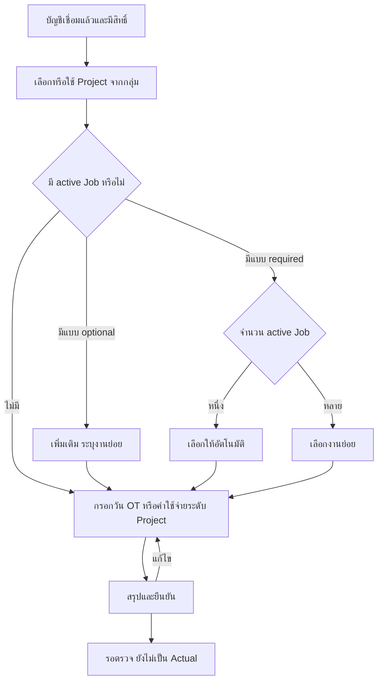

# Wireflow — Web และ LINE

DESIGNED; คำตอบ Owner รอบ2ตาม [ADR-007](adr/007-owner-decisions-m0-r2.md) ใช้กับทุกflow; ใช้ [fixtures](MILESTONE_0.md) เท่านั้น อ้าง MASTER §2–6, §10–11, §14/19; permission ตาม [matrix](PERMISSION_MATRIX.md)

## กฎร่วมทุกช่องทาง

1. ตรวจบัญชีและขอบเขต assignment; เลือก Project จากงานที่มีสิทธิ์ ถ้ามีเพียงงานเดียวเสนอ default ที่เปลี่ยนได้
2. ไม่มี Site ไม่แสดงคำถาม Site; ไม่มี Job ไม่แสดงช่อง/คำถาม/quick reply/ข้อผิดพลาด Job หรือค่า “ไม่ระบุ Job” ให้ผู้ใช้ต้องเลือก
3. Project มี Jobs แต่ optional: บันทึกที่ Project เป็น default, เปิดผ่าน “ระบุงานย่อย” เท่านั้น; required + 1 active Job เลือกอัตโนมัติ; required + หลายงานเลือก active Job; required + 0 active Job เป็น config error ให้ Admin แก้ ห้ามสร้าง Job ปลอม (proposal ADR-001)
4. ตรวจ Job อยู่ Project เดียวกันทั้งตอนเลือกและยืนยัน; recheck สิทธิ์/สถานะ active ทุกครั้ง; stale draft แสดงเหตุผลและให้เลือกใหม่ ไม่เปลี่ยน Project เงียบ
5. สรุปก่อนส่ง; ปุ่มเป็นคำกริยา: ยืนยันส่งตรวจ / แก้ไข / ยกเลิก; สำเร็จเมื่อบันทึกถาวรแล้วเท่านั้น ไม่แสดงยอด Payroll ใน LINE

## Web: เมนูและหน้าแรก

เมนูไม่เกิน 7 กลุ่มตาม MASTER: ภาพรวม / โครงการและงาน / รายการรอตรวจ / ต้นทุนและงบประมาณ / ทีมงานและค่าจ้าง / รายงานและหลักฐานบัญชี / ตั้งค่า แสดงเฉพาะความสามารถ role ที่มีจริง ในต้นแบบใช้ task cards 7 งานแทนเมนูระบบที่ยังไม่ได้พัฒนา

| Flow | หน้าจอ → action → ผลลัพธ์ | ข้อผิดพลาด/การกลับมา |
| --- | --- | --- |
| W-01 Login/home | ยืนยันตัวตน → งานที่ต้องตรวจ/งานที่รับผิดชอบ/งบใกล้เกินตามสิทธิ์ → เปิด Project | session หมดอายุ login ใหม่; ไม่เผยข้อมูลก่อนตรวจสิทธิ์ |
| W-02 Project | รายการ Project → สร้าง: ลูกค้า ชื่อ → สรุป → สร้างรหัสคงที่ → เพิ่มทีม; Site/Job อยู่เพิ่มเติม | ไม่มี Site/Job สร้างได้; unsaved ออกจากหน้าให้ยืนยัน; role/ข้อมูลผิดไม่บันทึกบางส่วน |
| W-03 Project detail | Overview → Time & OT / Expenses / Budget vs Actual / Activity; Jobs tab เมื่อมีงานย่อย | empty state บอกเพิ่มทีม/เริ่มลงงาน ไม่บังคับสร้าง Job |
| W-04 Budget (Owner) | Owner ตั้งหมวด/ยอด → draft version → อนุมัติ baseline → version ใหม่เมื่อแก้ | Admin/PM ไม่มีหน้า Budget; Job allocation ยังเป็น proposal Q-05 |
| W-05 Assignment | Project → เลือกช่าง → มอบหมายระดับ Project → ระบุ Job เฉพาะเมื่อจำเป็น | ช่างถูกถอนสิทธิ์ draft ต้องตรวจใหม่; ห้ามเลือก Job ต่าง Project |
| W-06 ตรวจรายการ | Admin ตรวจวัน/OT; Owner ตรวจ Expense ดูภาพจริง แก้ยอดพร้อมเหตุผล แล้วอนุมัติ/ปฏิเสธ | Admin/PM ไม่รับยอด/description/receipt URL ของexpense; ก่อนอนุมัติไม่เป็น Actual |
| W-07 Dashboard | Admin/PM เห็น headcount, distinct employee/date, man-days, OT; Owner เห็น Budget/Actual และ drill-down | เงินทุกประเภท Owner-only; pending ไม่รวม Actual; Payroll ไม่บวกซ้ำ |
| W-08 หลักฐาน (Owner) | เลือกเดือน → ดู approved expenses รวมทุกProject → เปิดภาพ/PDF → ดาวน์โหลด ZIP แตกเป็น folder เดือน/Project/Job | ไม่ให้ Admin/PM เข้าหน้านี้; ต้นแบบใช้ไฟล์ที่เลือกในmemory; storageจริง/restoreยังNOT_RUN |
| W-09 Admin ปิดเวลา | ข้อผิดปกติ → แก้/ตรวจวันกับ OT → วันที่ 1 ไม่เกิน 10:00 ส่ง Owner ตรวจ → TIME_REVIEWED | ไม่มีข้อมูลเงินใน API/export; rate หายแสดงเพียง Owner ต้องตรวจ; late เข้าคิวแยก |
| W-10 Owner สรุปค่าจ้าง | ข้อผิดปกติ → rate มีผล/วัน/OT → คำนวณ snapshot → เพิ่มหักพร้อมเหตุผล → สรุป → approve → lock → บันทึกโอน | rate/policy ขาดหรือซ้อน block; ก่อนจ่าย reopen สร้าง revision; หลังจ่าย late ปรับรอบถัดไป |
| W-11 Group binding | Project → สร้างรหัส single use/expiry → ผู้มีสิทธิ์ส่งในกลุ่ม → ตรวจและผูก → Activity | หมดอายุ/ใช้แล้ว/กลุ่มมี Project active ไม่ rebind เงียบ; ยกเลิกพร้อม audit |
| W-12 Settings | Owner/Admin ดูหมวด Job Type ปฏิทินตามสิทธิ์ → เพิ่ม/rename/reorder/disable | code ที่ใช้แล้วไม่เปลี่ยนความหมาย; rate/policy เฉพาะ Owner; snapshot เก่าคงเดิม |

## LINE: 5 actions เท่านั้น

ก่อนเข้า flow ผู้ไม่เชื่อมบัญชีได้รับปุ่มเชื่อมบัญชีผ่านช่องทางส่วนตัว ผู้ไม่มี assignment เห็น “ยังไม่มีโครงการที่ได้รับมอบหมาย ติดต่อผู้ดูแล”; external group user สั่งธุรกิจไม่ได้

| ID / เมนู | ขั้นตอนและข้อมูล | Success / กลับแก้ |
| --- | --- | --- |
| L-01 งานของฉัน | รายการ Project ที่ได้รับมอบหมาย → รายละเอียดวัน/ทีม/งานย่อยถ้ามี → เริ่มลงรายการ | Project A ใช้งานได้ทันที; closed แสดงประวัติแต่ลงใหม่ไม่ได้ |
| L-02 ลงวันทำงาน | Project → วันที่ → เต็มวัน/เช้า/บ่าย → สรุป → ส่งตรวจ | ทำ2Projectวันเดียวเลือกเช้าA/บ่ายB อย่างละ0.5วัน; รวม1วัน/ค่ากินตามครึ่งวันเดิม; ป้องกันช่วงวันซ้ำ |
| L-03 ลง OT | Project → วันที่ย้อนหลังได้ → จำนวนชั่วโมง → เหตุผล → สรุป → ส่งตรวจ | เช่น21ก.ย.8ชม. แม้ถึง22ก็คิดตาม21ทั้งรายการ ไม่บังคับเวลาเริ่ม/จบ; หลังปิดเวลาเข้าlate path |
| L-04 ส่งค่าใช้จ่าย | Project → วันที่ → หมวด9ประเภท → ยอด/รายละเอียด → เลือกภาพหรือPDF1–5ไฟล์ → preview → แก้/ลบ/เพิ่ม → สรุป → ส่งOwnerตรวจ | PENDING_REVIEW; ไม่มีOCR; file limit10MB; LABOR/OTคำนวณจากเวลา ไม่ส่งexpenseซ้ำ |
| L-05 ตรวจสถานะของฉัน | รายการตนเอง → filter รอตรวจ/อนุมัติ/ไม่ผ่าน → รายละเอียดและเหตุผล → แก้เป็น revision เมื่อได้รับสิทธิ์ | เห็นสถานะวัน/OT/expense ของตน ไม่เห็นค่าจ้างหรือยอด Project |

Expense summary A แสดง Project, วันที่, หมวด, 500.00 บาท, รายละเอียด, จำนวนไฟล์ และปุ่มยืนยัน ไม่แสดงบรรทัด Job; B แสดง Job เฉพาะที่เลือกจริง

## Group, retry และสถานะ UI

- กลุ่มใช้ Project ที่ binding active; draft key = channel + source kind + group/private ID + sender + Project + nullable Job + flow ID ทุกภาพต้องผูก draft ของผู้ส่งที่ถูกต้อง
- หากผู้ส่งมีหลาย draft ที่รับภาพได้ ให้ถามเจ้าของใน private เลือก draft ไม่เดาจากภาพล่าสุด; คนสองคนส่งสลับกันไม่แชร์ draft
- group confirmation ใช้เลขอ้างอิงและสถานะสั้น ๆ; รายละเอียดหลักฐาน/ชื่อพนักงาน/ค่าแรง/ยอดรวมไม่ออกกลุ่ม; private confirmation ตรวจสิทธิ์ผู้รับ
- loading: “กำลังบันทึก” disable double submit; บันทึกไม่สำเร็จคง draft และ retry idempotency key เดิม; network uncertain แสดงตรวจสถานะก่อนส่งใหม่
- ไฟล์เกิน 5/เกิน 10 MB/ชนิดไม่ผ่าน/ดาวน์โหลดไม่สำเร็จ: เก็บ draft แสดงไฟล์ที่มีปัญหา ไม่แจ้งว่าส่งตรวจสำเร็จ
- empty: อธิบายสิ่งที่ทำต่อได้; error: เหตุผลที่ไม่เปิดเผยข้อมูลและ correlation ID; unsaved: เก็บ/ละทิ้ง/กลับ; retry ไม่สร้าง source หรือ ledger ใหม่

ตัวเลข threshold: เขียว <80%; เหลือง 80–100%; ส้ม >100–110%; แดง >110%; zero budget แสดงไม่มีฐานเทียบ ไม่แสดง infinity ขอบเขต 100 อยู่เหลืองและ 110 อยู่ส้มเป็นข้อเสนอ ADR-001
